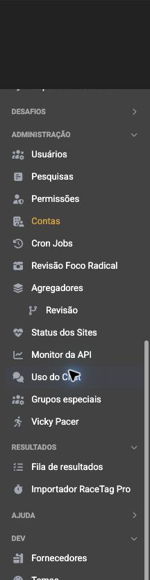

# Auditoria e proposta de reorganização do menu Business

Data: 23/08/2026  
Escopo: menu lateral nos contextos `Todas as contas` (admin) e conta ativa (cliente).  
Fonte: implementação atual em `includes/estrutura/sidenav.cfm` e navegação autenticada em `https://business.roadrunners.run/`.

## Veredito

O menu do cliente está saudável e precisa apenas de pequenos ajustes de nomenclatura. O menu administrativo já ultrapassou o limite de uma navegação lateral plana: são 47 entradas em 8 seções, com 636 px de conteúdo além da altura visível no viewport auditado. O principal problema não é a quantidade isoladamente, mas a mistura de critérios: destino (`Portal`), tipo genérico (`Ferramentas`), área (`Marketing`), permissão (`Administração`) e público interno (`DEV`).

A melhor direção é manter um menu curto no primeiro nível, organizar tudo por trabalho realizado e adicionar uma busca rápida para o admin.

## Evidências

### 1. Admin — início do menu

Saúde: ruim para descoberta. `Portal` abre 12 opções antes de o usuário chegar às rotinas operacionais. O estado persistido também permite várias seções abertas ao mesmo tempo.

### 2. Admin — parte inferior

Saúde: ruim para localização. `Administração` reúne 13 itens de assuntos diferentes; `Resultados` está separado de `Eventos`; `DEV` guarda tarefas que não são de desenvolvimento, como Email Marketing, CRM, fornecedores e configuração de treinos.

### 3. Cliente — menu completo

Saúde: boa. As 10 entradas cabem em 4 grupos e os principais trabalhos aparecem sem rolagem. A melhoria aqui é de clareza dos nomes e acesso explícito ao início.

## Inventário atual

| Perfil | Seções | Entradas | Observação |
|---|---:|---:|---|
| Admin | 8 | 47 | Portal (12), Ferramentas (5), Marketing (2), Desafios (4 nesta captura), Administração (13), Resultados (2), Ajuda (4), DEV (5) |
| Cliente | 4 | 10 | Ferramentas (4), Marketing (2), Empresa (2), Ajuda (2) |

## O que já funciona

- Admin e cliente recebem menus diferentes conforme o contexto da conta.
- As seções são recolhíveis e preservam o estado entre acessos.
- O item ativo tem destaque visual.
- Pendências específicas já podem receber badges.
- O seletor de conta no topo deixa o contexto atual visível.

## Problemas de maior impacto

1. **A taxonomia não responde “onde faço isso?”** `Portal`, `Ferramentas`, `Administração` e `DEV` usam critérios diferentes para agrupar itens.
2. **Há seções grandes demais.** `Portal` tem 12 entradas e `Administração`, 13. Recolher a seção só esconde o problema; ao abri-la, a lista volta a ficar longa.
3. **Itens relacionados estão separados.** Resultados ficam longe de Eventos; Email Marketing e CRM estão em DEV; Erros do portal ficam longe de Status dos Sites e Monitor da API.
4. **Alguns nomes não diferenciam bem o destino.** `Conteúdos`, `Conteúdo das provas`, `Verificados`, `Revisão`, `Uso do Chat` e `Vicky Pacer` exigem memória prévia.
5. **A hierarquia é inconsistente.** Vídeos e Conteúdos aparecem visualmente recuados, mas são irmãos dos “Canais”; somente Agregadores possui um submenu estrutural real.
6. **O acesso ao início é implícito.** Só o logo leva ao painel; falta uma entrada textual `Início` ou `Pendências`.
7. **O ícone de manutenção não resolve a descoberta.** Um indicador no topo informa volume, mas não oferece um caminho claro e textual para a fila de trabalho.

## Arquitetura recomendada para admin

Manter dois atalhos fixos no topo:

- **Início** — painel geral.
- **Pendências** — painel atual com fila de decisão, saúde do portal, manutenção e revisões; exibir o total agregado.

Depois, seis seções de primeiro nível:

### 1. Eventos e resultados

- Operação: Eventos, Percursos, Inscrições, Agendas.
- Resultados: Fila de resultados, Importar RaceTag Pro.
- Integrações e revisões: Foco Radical, Agregadores, Revisão de agregadores.
- Treinos: Configuração de treinos.
- Desafios: lista dinâmica dos desafios ativos.

### 2. Conteúdo e portal

- Editorial: Notícias e artigos, Fontes de conteúdo, Qualidade dos dados de eventos.
- Vídeo: Canais de vídeo, Vídeos.
- Distribuição: Banners, Notificações, Menu Runner Apps, Páginas verificadas.
- Identidade visual: Temas.

### 3. Marketing e audiência

- Campanhas: Publicidade, Cupons, Email Marketing, CRM.
- Insights: BI, Analytics de eventos, Buscas no site.
- Comunidade: Pesquisas, Analytics do Chat, Grupos especiais, Vicky — uso e auditoria.

### 4. Contas e parceiros

- Contas.
- Usuários.
- Permissões.
- Parceiros e fornecedores.

### 5. Plataforma

- Status dos sites.
- Monitor da API.
- Erros do portal.
- Automações (nome mais claro para Cron Jobs).

### 6. Ajuda

- FAQ.
- Suporte.
- Help Desk.
- Documentação operacional.

Essa estrutura preserva todas as 47 entradas atuais. A diferença é que o primeiro nível cai de 8 seções heterogêneas para 6 domínios previsíveis, e as listas maiores ganham subgrupos com nomes de tarefa.

## Ajuste recomendado para cliente

O menu pode continuar raso:

- **Início**.
- **Eventos**: Eventos, Percursos, Inscrições, Agendas.
- **Divulgação**: Publicidade, Cupons.
- **Conta**: Gestão da conta, Assinaturas.
- **Ajuda**: FAQ, Suporte.

Mudanças principais: `Ferramentas` vira `Eventos`, `Marketing` vira `Divulgação`, `Empresa` vira `Conta`, e o início deixa de depender apenas do logo.

## Comportamento recomendado

1. No admin, mostrar um campo compacto **Buscar no menu** com atalho `⌘K`/`Ctrl+K` e aliases como “job”, “erro”, “foco”, “chat”, “resultado” e “conta”.
2. Manter somente uma seção de primeiro nível aberta por vez; abrir automaticamente a seção e o subgrupo do item atual.
3. Persistir o último estado apenas quando isso não resultar em várias seções simultaneamente abertas.
4. Mostrar o total de pendências no atalho fixo e também no título da seção correspondente.
5. Usar nomes autossuficientes: `Revisão de agregadores`, `Erros do portal`, `Analytics do Chat`, `Páginas verificadas`.
6. Em uma segunda etapa, permitir 3 a 5 favoritos ou recentes no admin, sem duplicar todo o menu.

## Riscos de acessibilidade

- Os links têm 32 px de altura e os botões de seção, 27 px. É compacto para desktop, mas fica abaixo da recomendação confortável de 44 px para toque; precisa ser revisto no mobile.
- Os títulos das seções usam fonte muito pequena e contraste visual baixo. Devem ser medidos contra o fundo real.
- O uso de `aria-expanded` nas seções é positivo, mas foco visível, ordem de tabulação, anúncio do estado e reflow precisam de teste funcional; screenshots não confirmam esses pontos.
- O item ativo depende principalmente da cor amarela. É melhor acrescentar um marcador de forma ou borda, sem depender apenas de cor.

## Ordem de implementação sugerida

1. Reagrupar e renomear as entradas sem alterar rotas ou permissões.
2. Criar `Início` e `Pendências`, abrir apenas a árvore do item atual e limitar uma seção principal por vez.
3. Extrair o menu para uma configuração única por item (`label`, `href`, `section`, `subgroup`, `roles`, `aliases`, `badge`) para evitar novos blocos dispersos de `cfif`.
4. Adicionar busca rápida e, depois de observar o uso, favoritos/recentes.

## Limites da auditoria

As capturas comprovam hierarquia, densidade, rolagem e clareza visual nos dois perfis. Não foi feita uma rodada completa com teclado, leitor de tela, zoom de 200% ou viewport móvel; portanto, os pontos de acessibilidade são riscos a validar, não uma declaração de conformidade WCAG.
